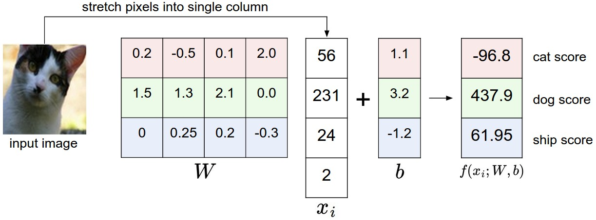

[TOC]

# Cs231n Lecture Notes

## Image Classification

### Challenges

- View point variation
- Scale variation
- Deformation
- Occlusion (reduced visibility due to other objects)
- Illumination
- Background clutter (objects may blend into background)
- Intra-class variation

### Classification Pipeline

1. Input
2. Learning
3. Evaluation

### Nearest Neighbor Classifier

We can represent images as I~1~ and I~2~ , then we can use **L1 distance** to compare them:

$$
d_1 (I_1, I_2) = \sum_{p} \left| I^p_1 - I^p_2 \right|
$$
Sum is taken over all pixels. 

We should flatten all images before using them.

```python
# flatten out all images to be one-dimensional
Xtr_rows = Xtr.reshape(Xtr.shape[0], -1) # Xtr_rows becomes 50000 x 3072
Xte_rows = Xte.reshape(Xte.shape[0], -1) # Xte_rows becomes 10000 x 3072
```

Then we can train and evaluate our classifier:

```python
nn = NN() # create a Nearest Neighbor classifier
nn.train(Xtr_rows , Ytr) # training classifier
Yte_predict = nn.predict(Xte_rows) # make prediction on test data
print('accuracy: %f' % (np.mean(Yte_predict == Yte))) # evaluate its performance
```

Following is the NN class implemented in python:

```python
import numpy as np

class NN(object):
    def __init__(self):
        pass
    
def train(self, X , y):
    '''
    X in N*D where each row is an example. Y is 1-dimension of size N
    '''
    # NN will simply remember all the training data
    self.Xtr = X
    self.ytr = y
    
def predict(self, X):
    '''
    X in N*D where each row is an example we want to predict label for
    '''
    num_test = X.shape[0]
    # output type match the input type
    Ypred = np.zeros(num_test, dtype = self.ytr.dtype) 
    
    # loop over all test rows
    for i in range(num_test):
        distances = np.sum(np.abs(self.Xtr - X[i,:]), axis = 1)
        max_index = np.argmin(distances)
        Ypred[i] = sel.ytr[min_index]
    
    return(Ypred)
    
```

We can also use L~2~ distance.

$$
d_2(I_1, I_2) = \sqrt{\sum_{p}(I_1^2 - I_2^2)^2}
$$

We just need to change a line in our code:

```python
distances = np.sqrt(np.sum(np.square(self.Xtr - X[i,:]), axis = 1))
```

In practice we don't need to include $sqrt()$ as it is a monotonic function and it won't affect the result.

### K-Nearest Neighbor

If use higher k value, it will help classifier to get generalization by smoothing the boundary.

### Validation sets for Hyperparameter tuning

Implementation on code:

```python
# assume we have Xtr_rows, Ytr, Xte_rows, Yte as before
# recall Xtr_rows is 50,000 x 3072 matrix
Xval_rows = Xtr_rows[:1000, :] # take first 1000 for validation
Yval = Ytr[:1000]
Xtr_rows = Xtr_rows[1000:, :] # keep last 49,000 for train
Ytr = Ytr[1000:]

# find hyperparameters that work best on the validation set
validation_accuracies = []
for k in [1, 3, 5, 10, 20, 50, 100]:
    # use a particular value of k and evaluation on validation data
    nn = NearestNeighbor()
    nn.train(Xtr_rows, Ytr)
    # here we assume a modified NearestNeighbor class that can take a k as input
    Yval_predict = nn.predict(Xval_rows, k = k)
    acc = np.mean(Yval_predict == Yval)
    print 'accuracy: %f' % (acc,)
    
    # keep track of what works on the validation set
    validation_accuracies.append((k, acc))
```


### Summary: Applying kNN in practice

If you wish to apply kNN in practice (hopefully not on images, or perhaps as only a baseline) proceed as follows:

1. Preprocess your data: *Normalize the features* in your data (e.g. one pixel in images) to have <u>zero mean and unit variance</u>. We will cover this in more detail in later sections, and chose not to cover data normalization in this section because pixels in images are usually homogeneous and do not exhibit widely different distributions, alleviating the need for data normalization.
2. If your data is very high-dimensional, consider using a dimensionality reduction technique such as PCA ([wiki ref](http://en.wikipedia.org/wiki/Principal_component_analysis), [CS229ref](http://cs229.stanford.edu/notes/cs229-notes10.pdf), [blog ref](http://www.bigdataexaminer.com/understanding-dimensionality-reduction-principal-component-analysis-and-singular-value-decomposition/)) or even [Random Projections](http://scikit-learn.org/stable/modules/random_projection.html).
3. Split your training data randomly into train/val splits. As a rule of thumb, between 70-90% of your data usually goes to the train split. This setting depends on how many hyperparameters you have and how much of an influence you expect them to have. If there are many hyperparameters to estimate, you should err on the side of having larger validation set to estimate them effectively. If you are concerned about the size of your validation data, it is best to split the training data into folds and perform cross-validation. If you can afford the computational budget it is always safer to go with cross-validation (the more folds the better, but more expensive).
4. Train and evaluate the kNN classifier on the validation data (for all folds, if doing cross-validation) for many choices of **k** (e.g. the more the better) and across different distance types (L1 and L2 are good candidates)
5. If your kNN classifier is running too long, consider using an Approximate Nearest Neighbor library (e.g. [FLANN](http://www.cs.ubc.ca/research/flann/)) to accelerate the retrieval (at cost of some accuracy).
6. Take note of the hyperparameters that gave the best results. There is a question of whether you should use the full training set with the best hyperparameters, since the optimal hyperparameters might change if you were to fold the validation data into your training set (since the size of the data would be larger). In practice it is cleaner to not use the validation data in the final classifier and consider it to be *burned* on estimating the hyperparameters. Evaluate the best model on the test set. Report the test set accuracy and declare the result to be the performance of the kNN classifier on your data.

### Linear Classification

2 disadvantages of KNN: 

- Stores all the training data, space inefficient 
- Requires a comparison with all the images for classification, expensive

Linear Classifier has 2 major components:

- **score function** that maps the raw data to class scores, f : R^D^ ↦ R^K^  
- **loss function** that quantifies  the agreement between the predicted scores and the ground truth label  

#### Parameterized mapping from images to label scores

**Linear classifier**: $f(x_i, W, b) = W x_i + b$

In the equation above, we assume that image $x_i$ has all of its pixels flattened out to a single column vector of shape [D,1]. (ex. D = 32 x 32 x 3 = 3072)

Matrix W of size [K,D] and vector b of size [K,1] are **parameters** of the function. 

Notes:

- Note that the single matrix multiplication $W x_i$ is effectively evaluating K classifiers in parallel (one for each class), where each classifier is a row of W. 
- Notice also that we think of the input data **$(x_i,y_i)$** as given and fixed, but we have control over the settings of the parameters W,b. Intuitively, we wish that correct class has a score that is higher than the scores of incorrect classes. 
- Once we train he classifier, we can discard the training data and keep only the learned parameters. 
- Classification of an image only involves single matrix multiplication and addition, faster than comparing a to all training images 

#### Interpreting a linear classifier

 

Linear classifier computes the score of a class as a weighted sum of all of its pixel values across all 3 of its color channels. Depending on precisely what values we set for these weights, the function has the capacity to like or dislike (depending on the sign of each weight) certain colors at certain positions in the image.

#### Analogy of images as high-dimensional points


Cartoon representation of the image space, where each image is a single point, and three classifiers are visualized. Using the example of the car classifier (in red), the red line shows all points in the space that get a score of zero for the car class. The red arrow shows the direction of increase, so all points to the right of the red line have positive (and linearly increasing) scores, and all points to the left have a negative (and linearly decreasing) scores.

------

**Interpretation of linear classifiers as template matching.** Another interpretation for the weights $W$ is that each row of $W$ corresponds to a *template* (or sometimes also called a *prototype*) for one of the classes. The score of each class for an image is then obtained by comparing each template with the image using an *inner product* (or *dot product*) one by one to find the one that “fits” best. 

#### Bias Trick

Recall that linear score function is defined as $f(x_i, W, b) = W x_i + b $. A commonly used trick is to combine b with W so that score function will be a single matrix multiplication $f(x_i, W) = W x_i$. 


#### Image Data Preprocessing

In ML it is very common to perform normalization to input features. In particular, it is important to **center the data** by subtracting the mean from every feature. In the case of images, this corresponds to computing a *mean image* across the training images and subtracting it from every image to get images where the pixels range from approximately [-127 … 127]. Further common preprocessing is to scale each input feature so that its values range from [-1, 1].

### Loss Function

#### Multiclass Support Vector Machine Loss

SVM loss setup such that it *wants* the correct class for each image to have a score higher than the incorrect classes by some fixed margin $\Delta$. 

The score function takes the pixels and computes the vector $f(x_i, W)$ of class scores, which we will denote as $s$ (scores). For example, the score for the j-th element is $s_j = f(x_i , W)_j$. The multiclass SVM loss for the i-th example than can be formalize as: 
$$
L_i =  \sum_{j \neq y_i} \max(0, s_j - s_{y_i} + \Delta )
$$
**Example**: Suppose we have 3 classes that receive the scores $s = [13, - 7, 11]$ and that the first class is the true class (i.e. $y_i = 0$). Also assume that $\Delta$ is 10. SVM loss sums over all the incorrect classes ($j \neq y_i$) so we get:
$$
L_i = \max(0, -7 - 13 + 10) + \max(0, 11 - 13 + 10)
$$
First term is 0 as it the score of the wrong class is not higher than (correct class score - $\Delta$). Second term is 8 as the difference is greater than 10.   

In summary, the SVM loss function wants the score of the correct class $y_i$ to be larger than the incorrect class scores by at least by $\Delta$(delta). If this is not the case, we will accumulate loss.

We can write our loss in linear terms also:
$$
L_i = \sum_{j \neq y_i} \max(0, w^T_j x_i - w^T_{y_i} x_i + \Delta)
$$


where $w_j$ is the j-th row of $W$ reshaped as a column. 

Term $\max(0,-)$ function is often called the **hinge loss**. There is also a squared hinge loss (L2- SVM) which uses the form $\max(0, -)^2$ that penalizes violated margins more strongly. 


The Multiclass Support Vector Machine "wants" the score of the correct class to be higher than all other scores by at least a margin of delta. If any class has a score inside the red region (or higher), then there will be accumulated loss. Otherwise the loss will be zero. Our objective will be to find the weights that will simultaneously satisfy this constraint for all examples in the training data and give a total loss that is as low as possible.

------

#### Regularization

L2 norm is the most common regularization: 
$$
R(W) = \sum_k \sum_l W_{k,l}^2
$$
Note that regularization function is not a function of data, it is based on weights.

Full SVM loss consist of 2 parts data and regularization loss:
$$
L = \underbrace{\frac{1}{N}\sum_i L_i}_\text {data loss} + \underbrace{\lambda R(W)}_\text{regularization loss}
$$
$\lambda$ needs to be adjusted with cross-validation.

It turns out that including the L2 penalty leads to the appealing **max margin** property in SVMs (See [CS229](http://cs229.stanford.edu/notes/cs229-notes3.pdf)  lecture notes for full details if you are interested).

The most appealing property is that penalizing large weights tends to improve generalization, because it means that no input dimension can have a very large influence on the scores all by itself. 

Since the L2 penalty prefers smaller and more diffuse weight vectors, the final classifier is encouraged to take into account all input dimensions to small amounts rather than a few input dimensions and very strongly.

Lastly, note that due to the regularization penalty we can never achieve loss of exactly 0.0 on all examples, because this would only be possible in the pathological setting of $W=0$.

------

Implementation of loss function in code:

```python
def L_i(x, y, W):
    '''
    Unvectorized version. Compute the multiclass svm loss for a single example 	       (x,y)
    - x is a column vector representing an image (e.g. 3073,1)
    - y is an integer giving index of correct class (e.g. between 0 and 9)
    - W is the weight matrix (e.g. 10,3073)
    '''
    delta = 1.0 # we can take delta as 0 in every case, see notes
    scores = W.dot(x) # matrix, vector multiplication, get [10,1] vector of scores
    correct_class_score = scores[y]
    D = W.shape[0] # number of classes, e.g. 10
    loss_i = 0.0
    for j in range(D): # iterate over all wrong classes
        if j == y: # if correct class
            continue # skip 
        # accumulate loss for the i-th example
        loss_i += max(0, scores[j] - correct_class_score + delta)
    return loss_i

def L_i_vectorized(x, y, W):
    '''
    A faster implementation. for a single example implementation contains no loop.
    '''
    delta = 0
    scores = W.dot(x)
    # compute the margin for all classes in one vector operation
    margins = np.maximum(0, scores - scores[y] + delta)
    margins[y] = 0
    loss_i = np.sum(margins)
    return loss_i

def L(X, y, W):
    '''
    Fully-vectorized implementation :
    - X holds all the training examples as columns (e.g. 3073 x 50,000 in CIFAR-10)
    - y is array of integers specifying correct class (e.g. 50,000-D array)
    - W are weights (e.g. 10 x 3073)
    '''
    # evaluate loss over all examples in X without using any for loops
    delta = 0
    scores = W.dot(X) # get a matrix of shape [10,50000]
    margins = np.maximum(0, scores - scores[np.arrange(y.shape[0]), y] + delta)
    margins[y] = 0
    loss_i = np.sum(margins, 1)
    return loss_i
```


