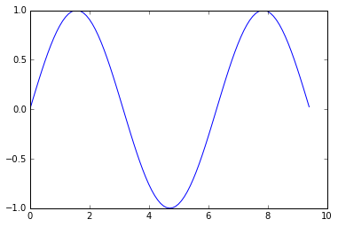
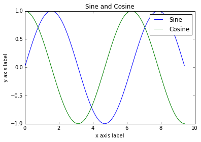
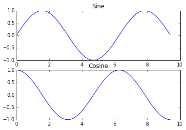
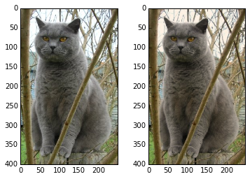

[TOC]

# Numpy Notes

`a = np.array([1, 2, 3])`		

Create a rank 1 array

------

`a = np.zeros((2, 2))` 

Create an array of all zeros

------

`a = np.ones((2, 2))`   

Create an array of all ones

------

`b = np.full((2, 2), 7)` 

Create a constant array

------

`c = np.eye(2)` 

Create a 2 x 2 identity matrix

------

`d = np.random.random((2, 2))` 

Create an array filled with random values

`"[[ 0.91940167 0.08143941]`

`[ 0.68744134 0.87236687]]"`

------

`nums = np.arange(8)`

print(nums)

`[0 1 2 3 4 5 6 7]`

------

`nums.reshape((4, -1))`

The -1 in reshape corresponds to an unknown dimension that numpy will figure out, based on all other dimensions and the array size. Can only specify one unknown dimension. For example, sometimes we might have an unknown number of data points, and so we can use -1 instead without worrying about the true number.

------

`np.add(x, y) or x+y`

Elementwise sum; both produce the array

------

`np.subtract(x,y) or x-y`

Elementwise difference

------

`np.multiplay(x,y) or x*y`

Elementwise product

------

`np.divide(x,y) or x/y`

Elementwise division

------

`np.dot(w.T, X) = wT*X` => matrix multiplication 

------

`np.sqrt(x)`

------

`print( a[0, ::-1])`

Steps are also supported in indexing. The following reverses the first row:

Prints `[4 3 2 1]`

------

fancy indexing

```python
#Create a new array from which we will select elements
a = np.array([[1, 2, 3],
[4, 5, 6],
[7, 8, 9],
[10, 11, 12]])
print(a) 
# prints "array([[ 1, 2, 3],
# [ 4, 5, 6],
# [ 7, 8, 9],
# [10, 11, 12]])"
# Create an array of indices
b = np.array([0, 2, 0, 1])
# Select one element from each row of a using the indices in b
print(a[np.arange(4), b]) # Prints "[ 1 6 7 11]"
# Mutate one element from each row of a using the indices in b
a[np.arange(4), b] += 10
print(a) # prints "array([[11, 2, 3],
# [ 4, 5, 16],
# [17, 8, 9],
# [10, 21, 12]])
```

------

**Broadcasting** two arrays together follows these rules:

1. If the arrays do not have the same rank, prepend the shape of the lower rank array with 1s until both shapes have the same length.
2. The two arrays are said to be compatible in a dimension if they have the same size in the dimension, or if one of the arrays has size 1 in that dimension.
3. The arrays can be broadcast together if they are compatible in all dimensions.
4. After broadcasting, each array behaves as if it had shape equal to the elementwise maximum of shapes of the two input arrays.
5. In any dimension where one array had size 1 and the other array had size greater than 1, the first array behaves as if it were copied along that dimension.

------

Modifying the view will modify the array

```python
x = np.arange(5)
print('Original:\n', x)
view = x[1:3]
view[1] = -1
print('Array After Modified View:\n', x) 

## Original:
## [0 1 2 3 4]
## Array After Modified View:
##  [ 0  1 -1  3  4]
```

Modifying the array will modify the view

```python
x = np.arange(5)
view = x[1:3]
view[1] = -1
print('View Before Array Modification:\n', view)  
x[2] = 10
print('Array After Modifications:\n', x)          
print('View After Array Modification:\n', view)  

## View Before Array Modification:
##  [ 1 -1]
## Array After Modifications:
##  [ 0  1 10  3  4]
## View After Array Modification:
##  [ 1 10]
```

Modifying the result of the selection due to fancy indexing **will not modify the original array**.

```python
x = np.arange(5)
print('Original:\n', x)  # Prints [0 1 2 3 4]

# Modifying the result of the selection due to fancy indexing
# will not modify the original array.
copy = x[[1, 2]]
copy[1] = -1
print('Copy:\n', copy) # Prints [1 -1]
print('Array After Modified Copy:\n', x)  # Prints [0 1 2 3 4]

## Original:
##  [0 1 2 3 4]
## Copy:
##  [ 1 -1]
## Array After Modified Copy:
##  [0 1 2 3 4]
```

------

np.argmin(distances)` = get the index with smallest distance

------

`X_flatten = X.reshape(X.shape[0], -1)` => flatten a matrix of shape (a,b,c,d) to (a, b*c*d)

------

`np.sum(keepdims = True)` => prevents outputting rank 1 arrays (n,), instead -> (n,1)

------

`X*dZ` = elementwise multiplication

------

`np.argsort(X)` = Returns the indices that would sort an array. 

```python
x = np.array([3, 1, 2])
np.argsort(x)
print(x)
# array([1, 2, 0])
```

------

`difference = np.linalg.norm(dists - dists_one, ord='fro')`

There are many ways to decide whether two matrices are similar; one of the simplest is the Frobenius norm. In case you haven't seen it before, the **Frobenius** norm of two matrices is the square root of the squared sum of differences of all elements; in other words, reshape the matrices into vectors and compute the Euclidean distance between them.

------

`np.split_array(X, 3)` => Split an array into multiple sub-arrays.

```python
x = np.arange(8.0)
np.array_split(x, 3)
# [array([ 0., 1., 2.]), array([ 3., 4., 5.]), array([ 6., 7.])]
```

------

`numpy.hstack(a,b)` => Stack arrays in sequence horizontally (column wise).

```python
a = np.array([[1],[2],[3]])
b = np.array([[2],[3],[4]])
np.hstack((a,b))
# array([[1, 2],
# [2, 3],
# [3, 4]])
```

------

`numpy.nditer`

Efficient multi-dimensional iterator object to iterate over arrays.

```python
# x is a numpy array
it = np.nditer(x, flags = ['multi_index'], op_flags = ['readwrite'])
```

---------

# SciPy

SciPy provides some basic functions to work with images. For example, it has functions to read images from disk into numpy arrays, to write numpy arrays to disk as images, and to resize images. Here is a simple example that showcases these functions:

```python
from scipy.misc import imread, imsave, imresize

# Read an JPEG image into a numpy array
img = imread('assets/cat.jpg')
print(img.dtype, img.shape)  # Prints "uint8 (400, 248, 3)"

# We can tint the image by scaling each of the color channels
# by a different scalar constant. The image has shape (400, 248, 3);
# we multiply it by the array [1, 0.95, 0.9] of shape (3,);
# numpy broadcasting means that this leaves the red channel unchanged,
# and multiplies the green and blue channels by 0.95 and 0.9
# respectively.
img_tinted = img * [1, 0.95, 0.9]

# Resize the tinted image to be 300 by 300 pixels.
img_tinted = imresize(img_tinted, (300, 300))

# Write the tinted image back to disk
imsave('assets/cat_tinted.jpg', img_tinted)
```

​                                        

**Distance between points**

SciPy defines some useful functions for computing distances between sets of points.

The function `scipy.spatial.distance.pdist` computes the distance between all pairs of points in a given set:

```python
import numpy as np
from scipy.spatial.distance import pdist, squareform

# Create the following array where each row is a point in 2D space:
# [[0 1]
#  [1 0]
#  [2 0]]
x = np.array([[0, 1], [1, 0], [2, 0]])
print(x)

# Compute the Euclidean distance between all rows of x.
# d[i, j] is the Euclidean distance between x[i, :] and x[j, :],
# and d is the following array:
# [[ 0.          1.41421356  2.23606798]
#  [ 1.41421356  0.          1.        ]
#  [ 2.23606798  1.          0.        ]]
d = squareform(pdist(x, 'euclidean'))
print(d)
```

------

# Matplotlib

**Plotting**

The most important function in matplotlib is `plot`, which allows you to plot 2D data. Here is a simple example:

```python
import numpy as np
import matplotlib.pyplot as plt

# Compute the x and y coordinates for points on a sine curve
x = np.arange(0, 3 * np.pi, 0.1)
y = np.sin(x)

# Plot the points using matplotlib
plt.plot(x, y)
plt.show()  # You must call plt.show() to make graphics appear.
```



With just a little bit of extra work we can easily plot multiple lines at once, and add a title, legend, and axis labels:

```python
import numpy as np
import matplotlib.pyplot as plt

# Compute the x and y coordinates for points on sine and cosine curves
x = np.arange(0, 3 * np.pi, 0.1)
y_sin = np.sin(x)
y_cos = np.cos(x)

# Plot the points using matplotlib
plt.plot(x, y_sin)
plt.plot(x, y_cos)
plt.xlabel('x axis label')
plt.ylabel('y axis label')
plt.title('Sine and Cosine')
plt.legend(['Sine', 'Cosine'])
plt.show()
```



**Subplots**

You can plot different things in the same figure using the `subplot` function. Here is an example:

```python
import numpy as np
import matplotlib.pyplot as plt

# Compute the x and y coordinates for points on sine and cosine curves
x = np.arange(0, 3 * np.pi, 0.1)
y_sin = np.sin(x)
y_cos = np.cos(x)

# Set up a subplot grid that has height 2 and width 1,
# and set the first such subplot as active.
plt.subplot(2, 1, 1)

# Make the first plot
plt.plot(x, y_sin)
plt.title('Sine')

# Set the second subplot as active, and make the second plot.
plt.subplot(2, 1, 2)
plt.plot(x, y_cos)
plt.title('Cosine')

# Show the figure.
plt.show()
```



**Images**

```python
import numpy as np
from scipy.misc import imread, imresize
import matplotlib.pyplot as plt

img = imread('assets/cat.jpg')
img_tinted = img * [1, 0.95, 0.9]

# Show the original image
plt.subplot(1, 2, 1)
plt.imshow(img)

# Show the tinted image
plt.subplot(1, 2, 2)

# A slight gotcha with imshow is that it might give strange results
# if presented with data that is not uint8. To work around this, we
# explicitly cast the image to uint8 before displaying it.
plt.imshow(np.uint8(img_tinted))
plt.show()
```

